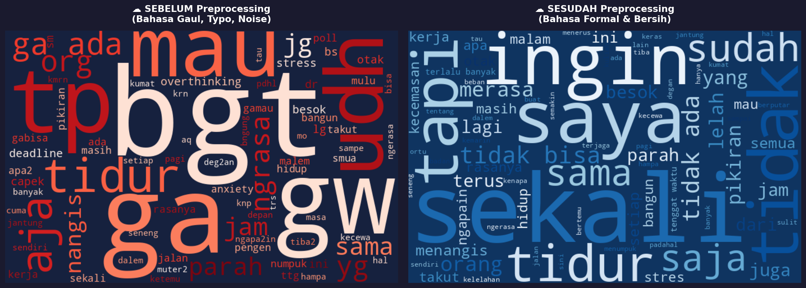

# Tubes_DIP
# DESKRIPSI DATASET
Dataset ini terdiri dari 1.145 baris cuitan keluhan kesehatan mental dalam Bahasa Indonesia yang diambil dari Twitter/X. Data terbagi ke dalam 3 label utama: Cemas, Depresi, dan Stress. Versi mentah dapat diakses di folder data/raw/ dan versi bersih yang siap dimasukkan ke algoritma Machine Learning tersedia di folder data/processed
# Langkah-langkah menjalankan kode
Persiapan Awal
Buka browser dan pergi ke halaman Google Colab.
Masuk menggunakan akun Google kamu.

Langkah-Langkah Menjalankan Kode (Cell demi Cell)
Ikuti urutan penekanan tombol Run (ikon segitiga/putar di sebelah kiri setiap cell kodingan) dari bagian paling atas hingga bawah:

1. Langkah 1: Pemasangan dan Impor Library
Apa yang dilakukan: Menjalankan cell pertama di bawah judul "IMPOR LIBRARY". Skrip ini otomatis akan mengunduh dan menyiapkan pustaka penting seperti pandas, wordcloud, scikit-learn, hingga Sastrawi.

Cara eksekusi: Klik cell kode tersebut, lalu tekan tombol Play atau gunakan pintasan Shift + Enter. Pastikan muncul teks "Semua library berhasil diimport!".

2. Langkah 2: Mengunggah Dataset Mentah (dataset_mentah.csv)
Apa yang dilakukan: Skrip akan meminta input file data kotor yang berisi minimal 1.000 baris keluhan kesehatan mental hasil scraping.

Cara eksekusi: Jalankan cell pemuatan data, klik tombol "Choose Files" yang muncul di bawah cell, lalu pilih file .csv mentah dari komputermu.

3. Langkah 3: Menjalankan Data Profiling & Basic Cleaning
Apa yang dilakukan: Sistem akan otomatis menghitung persentase data duplikat, mengecilkan huruf (case folding), serta membuang komponen pengganggu seperti URL, hashtag, angka, dan mention bot.

Cara eksekusi: Tekan Run pada cell-cell di bagian ini secara berurutan. Periksa hasil tabel pratinjau untuk memastikan teks kotor sudah mulai bersih.

4. Langkah 4: Penerapan Kamus dan Normalisasi Lanjutan (Advanced Normalization)
Apa yang dilakukan: Mengubah bahasa gaul menjadi baku serta mengekspor file kamus slang_mental_health.json secara otomatis ke dalam folder bernama dictionary.

Cara eksekusi: Cukup jalankan cell tersebut. File kamus akan otomatis terbuat di panel penyimpanan kiri Google Colab kamu.

5. Langkah 5: Pelabelan Otomatis (Keyword-based Labeling)
Apa yang dilakukan: Teks yang sudah baku dikelompokkan ke dalam kategori Cemas, Depresi, atau Stress berdasarkan kemunculan kata kunci tertentu.

Cara eksekusi: Jalankan cell pelabelan. Skrip juga akan otomatis mengekstrak sampel acak 100 baris ke file data_validasi_manual.csv untuk kebutuhan validasi manualmu di Excel.

6. Langkah 6: Pembuatan Visualisasi Word Cloud
Apa yang dilakukan: Menghasilkan grafik komparasi kata yang paling sering muncul sebelum dibersihkan versus sesudah dibersihkan. Gambar ini akan disimpan dengan nama wordcloud_comparison.png.

Cara eksekusi: Jalankan cell visualisasi, tunggu hingga gambar Word Cloud muncul di layar Colab kamu.

7. Langkah 7: Final Ekspor Data Siap Machine Learning
Apa yang dilakukan: Cell terakhir ini akan menyaring kolom murni (formal_text dan label), menyimpannya ke dalam struktur jalur folder data/processed/dataset_bersih.csv, dan secara otomatis memicu browser kamu untuk mengunduh langsung file siap pakai tersebut ke komputermu.

Cara eksekusi: Jalankan cell terakhir dan izinkan browser jika meminta izin unduhan otomatis (pop-up download).

# Visualisasi Word Cloud

